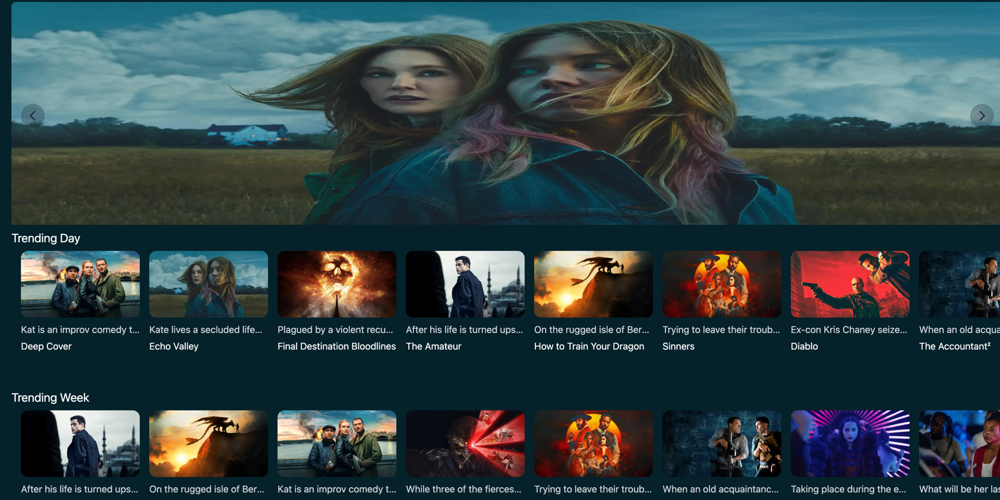

# NVX Web Movies

<h3 align="center">🎬 A Modern Web Application for Exploring the World of Cinema 🎬</h3>

<p align="center">
  A fast, responsive, and modern web application for Browse and discovering movies, built with the latest technologies from Next.js and Tailwind CSS.
</p>

<p align="center">
  <a href="https://web-movie-consumption-api.vercel.app/"><strong>View Live Demo »</strong></a>
</p>

<p align="center">
  
  
  
  
</p>

<p align="center">
  
</p>

---

## ✨ Features

-   ✅ **Browse Movies:** Explore popular, top-rated, and trending movies.
-   ✅ **Smart Search:** Quickly and accurately search for movies by title.
-   ✅ **Comprehensive Details:** View detailed information for each movie, including synopsis, cast, ratings, and official trailers.
-   ✅ **Responsive Interface:** Optimized for all screen sizes, from desktop to mobile.
-   ✅ **Modern User Experience:** A UI/UX designed for an engaging and intuitive movie discovery experience.

## 🛠️ Tech Stack

This application is built using a modern ecosystem focused on performance and developer experience.

-   **Framework:** [Next.js](https://nextjs.org/) 13+ (App Router)
-   **Language:** [TypeScript](https://www.typescriptlang.org/)
-   **Styling:** [Tailwind CSS](https://tailwindcss.com/)
-   **State Management & Data Fetching:** Native `fetch` API with React Server Components (RSC)
-   **Movie Data Source:** [The Movie Database (TMDB) API](https://www.themoviedb.org/documentation/api)
-   **Deployment:** [Vercel](https://vercel.com/)

## 🚀 Getting Started

Follow these steps to get a local copy of the project up and running for development and testing purposes.

### 1. Prerequisites

Ensure you have the following software installed:
-   [Node.js](https://nodejs.org/en/) (v16 or later)
-   [pnpm](https://pnpm.io/installation) (or `npm`/`yarn`)

### 2. Installation & Setup

1.  **Clone this repository:**
    ```
    git clone [this project]
    cd project
    ```

2.  **Install all dependencies:**
    ```bash
    pnpm install
    ```

3.  **Configure Environment Variables:**
    This application requires an API key from TMDB.

    -   Create a file named `.env.local` in the project's root directory.
    -   Register for a free API key on the [TMDB website](https://www.themoviedb.org/signup).
    -   Add the following variable to your `.env.local` file:
        ```env
        NEXT_PUBLIC_TMDB_API_KEY="YOUR_TMDB_API_KEY_HERE"
        ```

### 3. Running the Development Server

Once the setup is complete, run the following command to start the development server:

```bash
pnpm dev
```

Open [http://localhost:3000](http://localhost:3000) in your browser to see the app in action.

### 4. Building for Production

To create a production-ready build, run:

```bash
pnpm build
pnpm start
```

## 📂 Project Structure

This project's directory structure follows the Next.js App Router conventions for scalability and readability.

```
nvx-web-movies/
├── app/                  # Main pages, layouts, and app routes
│   ├── (api)/            # API routes (e.g., /api/movies)
│   ├── (components)/     # UI components used across the application
│   ├── (lib)/            # Helper functions, utilities, and type definitions
│   ├── layout.tsx        # Main application layout
│   └── page.tsx          # Homepage
├── public/               # Static assets (images, fonts, icons)
├── tailwind.config.ts    # Tailwind CSS configuration
└── ...                   # Other configuration files
```

## 🚢 Deployment

The easiest way to deploy this Next.js application is by using [Vercel](https://vercel.com/), the platform from the creators of Next.js.

[](https://vercel.com/)

Click the button above to automatically clone and deploy this project. Don't forget to add the `NEXT_PUBLIC_TMDB_API_KEY` environment variable in your Vercel project settings.

## 🤝 Contributing

We warmly welcome contributions from the community! If you'd like to contribute:

1.  **Fork** this repository.
2.  Create a new **Feature Branch** (`git checkout -b feature/YourNewFeature`).
3.  **Commit** your changes (`git commit -m 'feat: Add YourNewFeature'`).
4.  **Push** to your branch (`git push origin feature/YourNewFeature`).
5.  Open a **Pull Request**.

## 📄 License

This project is licensed under the [MIT License](https://opensource.org/license/mit). See the `LICENSE` file for more details.

## 📬 Contact

**Satria Nur Saputro**

-   Email: [satrianursaputro06@gmail.com](mailto:satrianursaputro06@gmail.com)

---

Made with ❤️ and a passion for cinema.